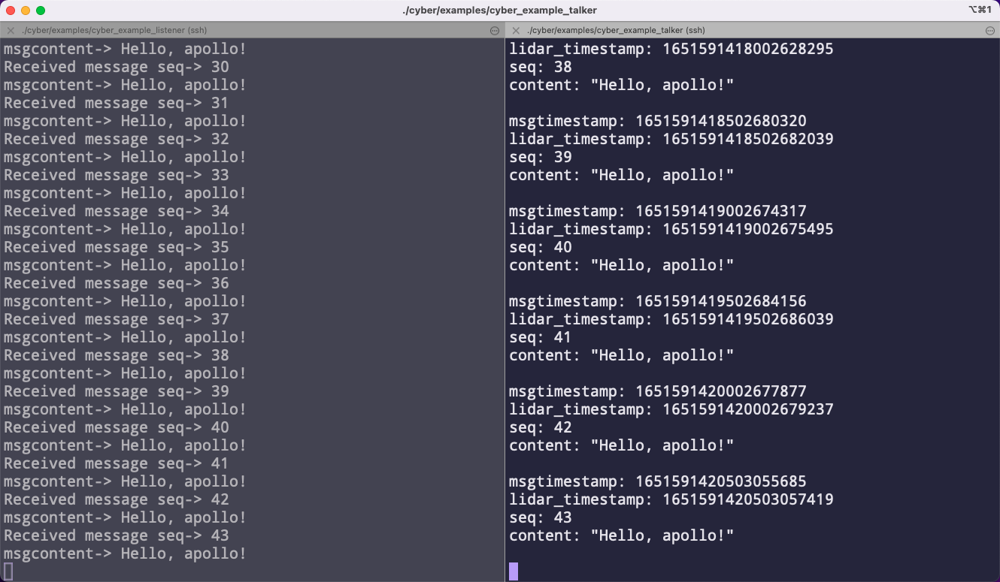

# Apollo(v7.0.0) Cyber 



## #1 env

```shell
Ubuntu18
```

```shell
sudo apt install libpoco-dev
sudo apt install uuid-dev
pip3 install protobuf
```


## #2 build

1. download

```shell
git clone https://github.com/minhanghuang/CyberRT.git
cd CyberRT
```

2. export library path

> third party(gflag gtest glog fastrtps fastcdr...)

```shell
sudo mkdir /opt/cyber
sudo cp -r env/ /opt/cyber/env
```

```shell
// bash 
source /opt/cyber/env/setup.bash

// zsh 
source /opt/cyber/env/setup.zsh
```

3. generate protobuf

```shell
/opt/cyber/env/bin/protoc -I=cyber/proto/ --cpp_out=cyber/proto cyber/proto/*.proto

/opt/cyber/env/bin/protoc -I=cyber/examples/proto/ --cpp_out=cyber/examples/proto cyber/examples/proto/*.proto
```

4. build

```shell
mkdir build && cd build
cmake -DCMAKE_EXPORT_COMPILE_COMMANDS=ON ..
make 
```

5. run examples

- pub/sub

> talker 

```shell
source setup.bash
./cyber/examples/cyber_example_talker
```
> listener

```shell
source setup.bash
./cyber/examples/cyber_example_listener
```

- server/client

> server 

```shell
source setup.bash
./cyber/examples/cyber_example_server
```

> client 

```shell
source setup.bash
./cyber/examples/cyber_example_cilent
```

- component

```shell
source setup.bash
cyber_launch start share/examples/common.launch
./cyber/examples/common_component_example/channel_prediction_writer
./cyber/examples/common_component_example/channel_test_writer
```

## #3 tools

```
source setup.bash
cyber_channel list
```

