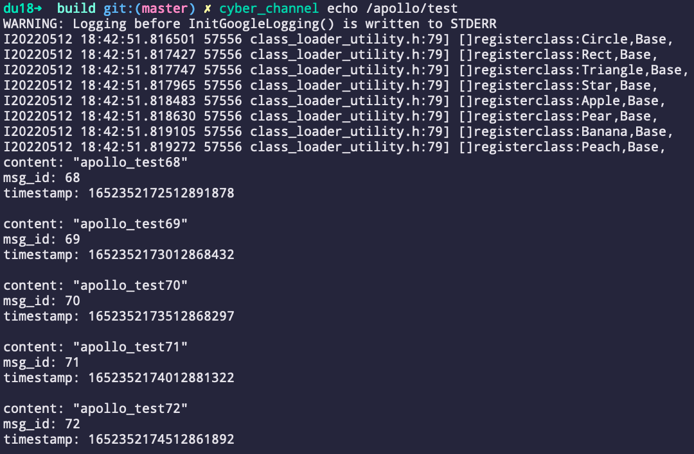

# Apollo(v9.0.0) CyberRT


| Target        |  CI Status  |
| ------------- | :-----:|
| Ubuntu18.04 x86-64   | [](https://github.com/minhanghuang/CyberRT/actions/workflows/ubuntu18-v9.0.0-build.yaml) |
| Ubuntu20.04 x86-64  | [](https://github.com/minhanghuang/CyberRT/actions/workflows/ubuntu20-v9.0.0-build.yaml) |
| Ubuntu22.04 x86-64  | [](https://github.com/minhanghuang/CyberRT/actions/workflows/ubuntu22-v9.0.0-build.yaml) |
| Ubuntu24.04 x86-64  | [](https://github.com/minhanghuang/CyberRT/actions/workflows/ubuntu24-v9.0.0-build.yaml) |
| Ubuntu latest x86-64  | [](https://github.com/minhanghuang/CyberRT/actions/workflows/ubuntu-latest-v9.0.0-build.yaml) |
| Ubuntu18.04 arrch64 | [](https://github.com/minhanghuang/CyberRT/actions/workflows/ubuntu18-arrch64-v9.0.0-build.yaml) |
| Ubuntu20.04  arrch64 | [](https://github.com/minhanghuang/CyberRT/actions/workflows/ubuntu20-arrch64-v9.0.0-build.yaml) |
| Ubuntu22.04 arrch64 | [](https://github.com/minhanghuang/CyberRT/actions/workflows/ubuntu22-arrch64-v9.0.0-build.yaml) |
| Ubuntu latest arrch64 | [](https://github.com/minhanghuang/CyberRT/actions/workflows/ubuntu-latest-arrch64-v9.0.0-build.yaml) |

## #1 Env

> dependence

```shell
sudo apt update
sudo apt install -y libpoco-dev uuid-dev libncurses5-dev python3-dev python3-pip
python3 -m pip install protobuf==3.14.0
```

## #2 Build

1. clone

```shell
git clone --single-branch --branch v9.0.0 https://github.com/minhanghuang/CyberRT.git
cd CyberRT
```

2. build third party

> install

```shell
sudo python3 install.py
# sudo python3 install.py --platform <your-platform-machine> --install_prefix <your-install-path>
```

> export path

```shell
source install/setup.bash
```

3. build cyber

```shell
mkdir build && cd build
cmake ..
make -j$(nproc)
```

## #3 Examples

1. pub/sub

> talker

```shell
source setup.bash
./cyber/examples/cyber_example_talker
```
> listener

```shell
source setup.bash
./cyber/examples/cyber_example_listener
```

2. component

```shell
source setup.bash
cyber_launch start share/examples/common_component_example/common.launch
./cyber/examples/common_component_example/channel_prediction_writer
./cyber/examples/common_component_example/channel_test_writer
```

## #4 Tools

1. channel

> list

```shell
source setup.bash
cyber_channel list

# The number of channels is:  1
# /apollo/test
```

> echo
```shell
source setup.bash
cyber_channel echo /apollo/test
```


> more ...

```shell
Commands:
	cyber_channel list	list active channels
	cyber_channel info	print information about active channel
	cyber_channel echo	print messages to screen
	cyber_channel hz	display publishing rate of channel
	cyber_channel bw	display bandwidth used by channel
	cyber_channel type	print channel type
```

2. node

```shell
Commands:
	cyber_node list 	List active nodes.
	cyber_node info 	Print node info.
```

3. service

```shell
Commands:
	cyber_service list	list active services
	cyber_service info	print information about active service
```

4. launch

```shell
cyber_launch start share/examples/common_component_example/common.launch
```

5. monitor

```shell
cyber_monitor
```

6. recorder

```shell
Commands:
  	cyber_recorder info	Show information of an exist record.
	cyber_recorder play	Play an exist record.
	cyber_recorder record	Record same topic.
	cyber_recorder split	Split an exist record.
	cyber_recorder recover	Recover an exist record.
```

## #5 Packages

```shell
cmake -DCMAKE_INSTALL_PREFIX=/you/install/path ..
make -j$(nproc)
make package
sudo dpkg -i package/*.deb
```

```
# CMakeLists.txt
find_package(PkgConfig REQUIRED)
pkg_check_modules(Cyber REQUIRED cyber)
include_directories(
  ${Cyber_INCLUDE_DIRS}
)
link_directories(${Cyber_LIB_DIRS})
target_link_libraries(${TARGET_NAME}
  ${Cyber_LIBRARIES}
)
```
